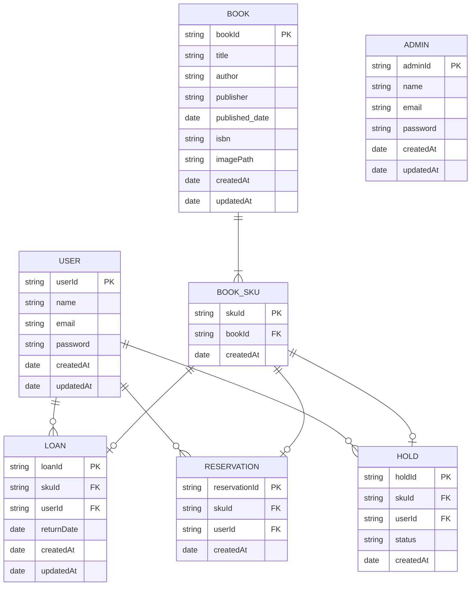

# 目的
本を管理する図書館アプリケーション

# 基本要件

- ユーザー側
  - ログイン
  - 本を探す
    - タイトル検索
  - 本の詳細情報を確認する
    - タイトルなど詳細情報 
    - 貸出状況
  - 本の取り置き依頼
  - 他の人に貸出中の本の予約
  - 貸出中の本の貸出延長
  - 貸出中の本を確認する
  - 予約中・取り置き中の本を確認する
- 管理者側
  - 本の登録
  - 本の情報の更新
  - 本の削除
  - 本の貸出状況の更新
    - 本の貸出
      - 在庫にある本の貸出
      - 取り置き済みの本の貸出
    - 本の返却
  - 本の取り置き完了登録
  - ユーザー新規作成

# 非機能要件
- ユーザー向けBEと管理者向けBEは分ける
  - 管理者向けBEは閉じたネットワークで接続することを想定

# ユースケース
## ユーザー側
- 本を探す
  - 事前条件：なし
  - トリガー：本のタイトルを検索ボックスに入力し、検索ボタンを押す
  - 基本フロー：
    1. 検索結果が表示される
    2. 検索結果から本を選択する
    3. 本の詳細情報が表示される
  - 例外フロー：
    - 検索結果が0件の場合
      - 検索結果が0件ですと表示される
  - 備考：
    - 詳細情報には以下の情報が含まれる
      - タイトル
      - 著者
      - 出版社
      - ISBN
      - 貸出状況
      - 予約状況

- 本の取り置き依頼
  - 事前条件：本の詳細情報が表示されており、貸出中/取り置き/予約済みでないこと
    取り置き完了でないこと
  - トリガー：取り置きボタンを押す
  - 基本フロー：
    1. 取り置き依頼が完了しましたと表示される
    2. 本の詳細情報に戻る
  - 例外フロー：
    - すでにユーザーが取り置き依頼している場合
      - すでに取り置き依頼していますと表示される
  - 備考：
    - 取り置き依頼が完了したら、予約状況が「取り置き処理中」に変更される

- 他の人に貸出中の本の予約
  - 事前条件：本の詳細情報が表示されており、貸出中/取り置き/予約済みであること
  - トリガー：予約ボタンを押す
  - 基本フロー：
    1. 予約が完了しましたと表示される
    2. 本の詳細情報に戻る
  - 例外フロー：
    - すでに予約されている場合
      - すでに予約されていますと表示される
  - 備考：
    - 最初の予約の場合は、予約状況が「予約済み」に変更される
    - 予約が1つ以上ある場合は、予約状況の予約人数が1増えて表示される

- 貸出中の本の貸出延長
  - 事前条件：ユーザーページの貸出中の本一覧が表示されており、貸出中であること
  - トリガー：貸出延長ボタンを押す
  - 基本フロー：
    1. 貸出延長が完了しましたと表示される
    2. 貸出中の本一覧に戻る
  - 例外フロー：
    - 本が他の人に予約されている場合
      - 予約している人がいるため貸出延長できません期限までに返却してくださいと表示される
  - 備考：
    - 貸出延長が完了したら、貸出状況が「貸出延長」に変更される
    - 貸出期限が延長される

## 管理者側
- 在庫にある本の貸出 
  - 事前条件：本の詳細情報が表示されており、該当の本が貸出中でないこと
  - トリガー：貸出ボタンを押す
  - 基本フロー：
    1. ユーザー情報を検索し、選択する
    1. 貸出が完了しましたと表示される
    2. 本の詳細情報に戻る
  - 例外フロー：
    - ユーザーが存在しない場合
      - ユーザーが存在しませんと表示される
  - 備考：
    - 貸出が完了したら、貸出状況が「貸出中」に変更される

- 取り置き完了の本の貸出
  - 事前条件：ユーザー一覧ページが表示されていること
  - トリガー：ユーザーを検索し、選択する
  - 基本フロー：
    2. ユーザーの取り置き完了の本一覧が表示される
    3. 取り置き済みの本一覧から本を選択する
    4. 貸出が完了しましたと表示される
    5. 取り置き済みの本一覧に戻る
  - 例外フロー：
    - ユーザーが存在しない場合
      - ユーザーが存在しませんと表示される
    - 取り置き済みの本が存在しない場合
      - 取り置き済みの本が存在しませんと表示される
  - 備考：
    - 貸出が完了したら、貸出状況が「貸出中」に変更される
    - 取り置き情報を削除する

- 本の返却
  - 事前条件：ユーザー一覧ページが表示されていること
  - トリガー：ユーザーを検索し、選択する
  - 基本フロー：
    1. ユーザーの貸出中の本一覧が表示される
    2. 貸出中の本一覧から本を選択する
    3. 本の返却が完了しましたと表示される
    4. 貸出中の本一覧に戻る
  - 例外フロー：
    - ユーザーが存在しない場合
      - ユーザーが存在しませんと表示される
    - 貸出中の本が存在しない場合
      - 貸出中の本が存在しませんと表示される
  - 備考：
    - 貸出が完了したら、貸出情報から削除される
    - 予約がある場合は、予約状況が「取り置き処理中」に変更される

# 設計
## 画面設計
- ユーザー向け画面
  - トップ画面（検索画面）
    - 検索結果画面
      - 本の詳細情報画面A
        - 取り置き依頼画面（ログイン必要）
        - 予約画面（ログイン必要）
  - ログイン画面
  - ログアウト画面（ログイン必要）
  - ユーザーページ（ログイン必要）
    - 貸出中の本一覧
      - 本の詳細情報画面A
    - 予約中・取り置き中の本一覧
      - 本の詳細情報画面A

- 管理者向け画面（全てログイン必要）
  - ログイン画面
  - ログアウト画面
  - ユーザー検索画面
    - ユーザー詳細情報画面
      - ユーザーの貸出中の本一覧
        - 本の詳細情報画面B
        - 本の貸出
        - 本の返却
      - ユーザーの予約中・取り置き中の本一覧
        - 本の詳細情報画面B
        - 本の貸出
        - 取り置き完了登録
      - ユーザー情報の更新画面
      - ユーザー情報の更新
      - ユーザー情報の削除
    - ユーザー新規作成
  - 本の検索画面
    - 本の詳細情報画面B
      - 本の情報の更新
      - 本の情報の削除
    - 本の新規登録
    - 既存の本の在庫追加

## DB設計

## 機能設計

# 技術選定
- フロントエンド
  - フレームワーク
    - Next.js (App Router)
      - 理由：
        - 直近でNext.jsのチュートリアルをやっていたため
  - UIライブラリ
    - shadcn/ui
      - 理由：
        - App Routerに対応しており、Server ComponentとClient Componentの両方で使用できるため
  - Validation
    - zod
  - フォーム
    - conform
      - 理由：
        - App Routerに対応しているおり、Server Actionと競合しないため
- バックエンド
  - フレームワーク
    - Yii2.0
      - 理由：
        - 直近でYii2.0を学ぶ必要があったため
  - データベース
    - PostgreSQL
      - 理由：
        - ネイティブでUUIDをサポートしており、パフォーマンスの劣化が少ないため
          - [Postgres と MySQL における id, created_at, updated_at に関するベストプラクティス](https://zenn.dev/mpyw/articles/rdb-ids-and-timestamps-best-practices)
      - 欠点：
        - updated_atの更新が自動で行われないため、トリガーを作成するor更新時にプログラム上で更新する必要がある

# 今後の修正
- パフォーマンス向上の観点からGETのクエリにlimitを追加
  - 例）/api/books?limit=10
  - 存在チェックなどはこれで十分
  - offsetの実装も検討
- DBのINDEX付与
  - ストレステスト
- backendエラー時のエラー内容隠蔽
  - ログに出力

# 追加機能候補

- ユーザー側
  - ページネーション
  - パスワード変更
  - ユーザー登録申請
  - 本のレビュー
  - 本の評価
  - 本の貸出履歴
  - 本の取り置き履歴
  - お知らせ機能
    - 返却期限の通知
    - 取り置き完了の通知
  - おすすめ本の表示
  - お問い合わせ機能
  - お気に入り機能
  - 検索機能
    - タイトル検索
    - 著者検索
    - 出版社検索
    - ISBN検索
  - トップページのお知らせ欄
  - 検索サジェスト
  - BOOK_SKUに場所情報を追加
    - どこにある本かを表示する
- 管理者側
  - ユーザー情報の更新
  - ユーザー情報の削除
  - ユーザー登録申請の承認
  - 管理者側のロール
    - 管理者
    - スタッフ
  - トップページにお知らせを追加
